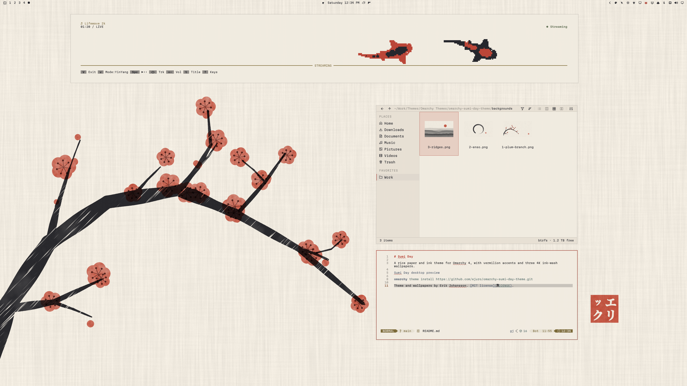
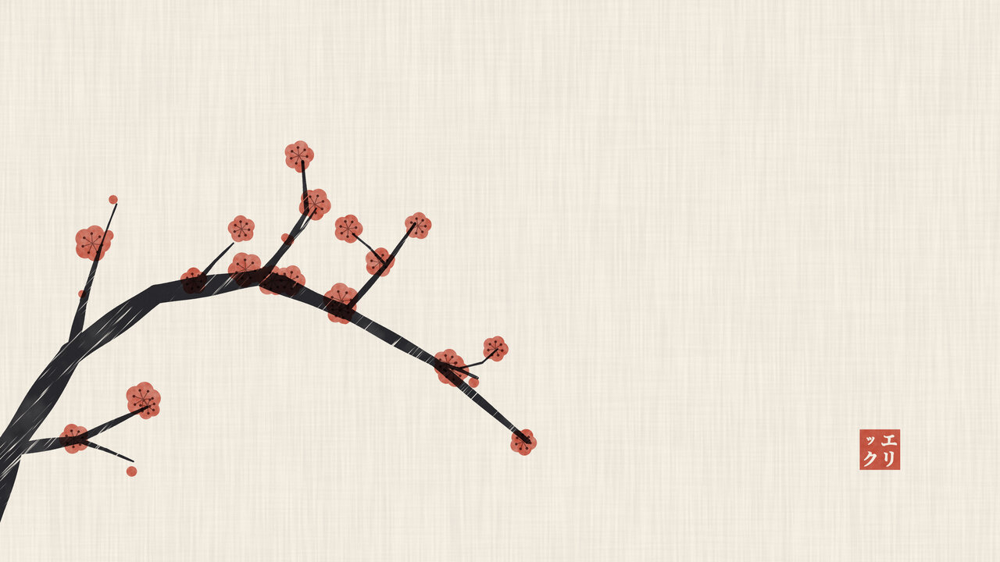
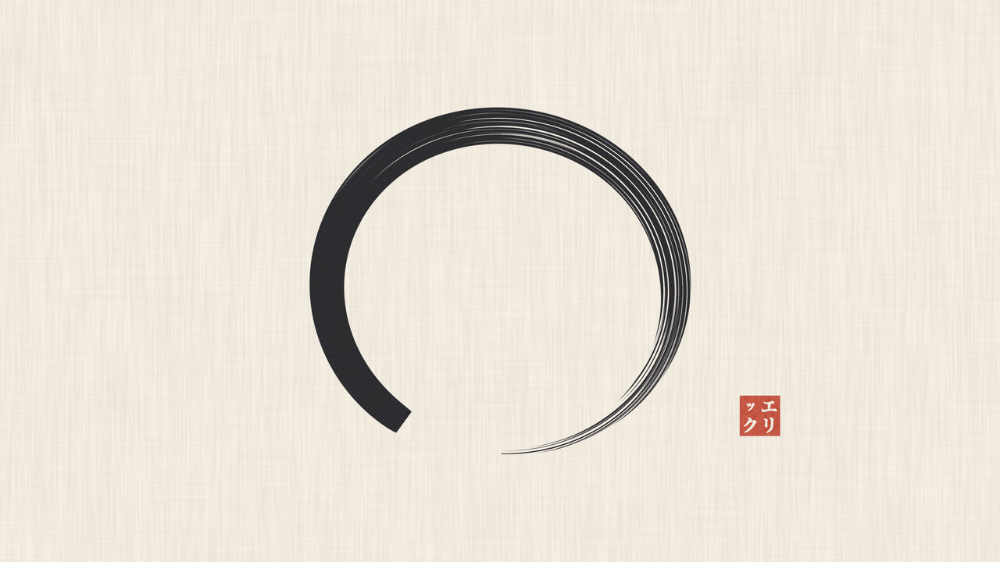

# Sumi Day

A rice paper and ink theme for Omarchy 4, with vermilion accents and four 4K ink-wash wallpapers.



```sh
omarchy theme install https://github.com/erikrjohansson/omarchy-sumi-day-theme.git
```

## Updating

To get new wallpapers and fixes, update your installed themes, then apply Sumi Day again so Omarchy picks up the new files:

```sh
omarchy theme update
omarchy theme set sumi-day
```

## Wallpapers

Plum branch (default), ensō, ridges and koi. Cycle through them from the Omarchy menu under Style → Background.

<table>
  <tr>
    <td width="50%"></td>
    <td width="50%"></td>
  </tr>
  <tr>
    <td align="center">Plum branch</td>
    <td align="center">Ensō</td>
  </tr>
  <tr>
    <td width="50%"></td>
    <td width="50%"></td>
  </tr>
  <tr>
    <td align="center">Ridges</td>
    <td align="center">Koi</td>
  </tr>
</table>

Theme and wallpapers by Erik Johansson. [MIT license](LICENSE).
